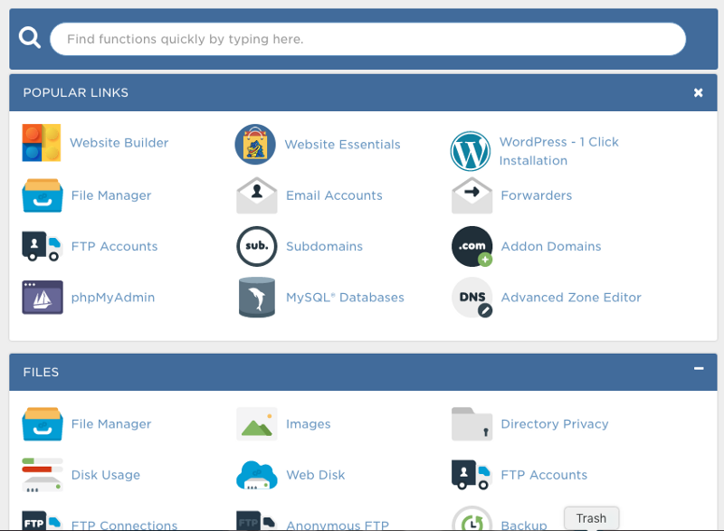
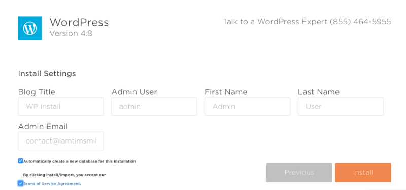
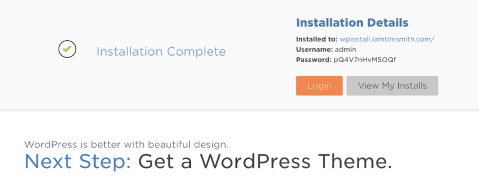
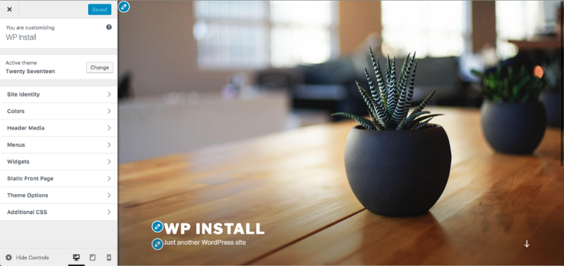
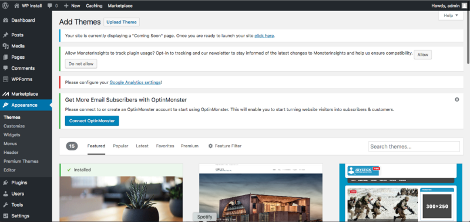
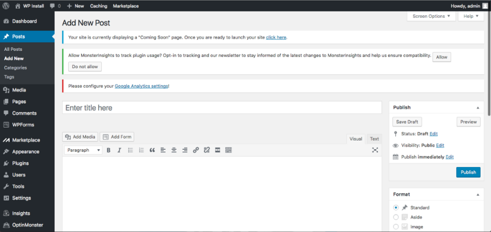
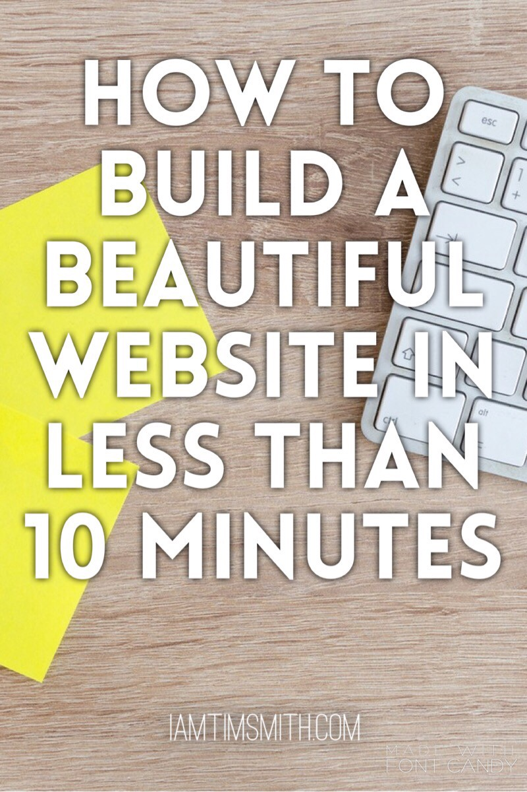

I remember when I decided to set up my first website. It was for my band, The Effie Afton and I was completely lost. I asked a web designer how much it would be to have him build a site and he quoted me \$1000. Are you kidding me?! A starving musician can’t afford that! It was at this time that I discovered an amazing tool called Wordpress. In this article, I will teach you how to build a website in less than 10 minutes.

Wordpress is a content management system, or CMS, that is used by 25% of the websites on the internet. If that doesn’t sound like a lot to you, I’ll put it another way. As of this writing, Wordpress is used by over 301,651,380 websites and that number is always growing. That’s A LOT of websites! Why is this tool so popular? Because it allows anyone to set up a website without any knowledge of coding or web design.

If you just google “Wordpress”, you’re likely to come up with quite a few results but toward the top you may see “Wordpress.com” and “Wordpress.org”. While these websites are both operated by the same company, they do have some differences. Today we will be talking specifically about Wordpress.org, but I will explain the differences briefly to give you an overview.

### Wordpress.com and Wordpress.org

At first glance, Wordpress.com and Wordpress.org can seem like the same thing. For the most part, they perform the same task: providing an easy-to-use interface to help write and manage your website and the content you create. The major difference between the two is hosting.

A Wordpress.com website is a fully-hosted website meaning that if you create a website there, your web address will be something like example.Wordpress.com. The options for a website with Wordpress.com are also fewer. There are a small number of themes to choose from when deciding on an appearance for your site when using the fully-hosted platform. Overall, Wordpress.com just has a lot less ability in terms of customizations than Wordpress.org.

On the other hand, a Wordpress.org website is a self hosted website. This means that you will need your own hosting in place to store all of the data and files for your website. Creating a website with Wordpress.org allows for a lot more freedom when creating a design. Not only are there many more options for themes, plugins are also available to accomplish just about anything you could think of. In addition, hosting your website yourself means you are in complete control of every aspect which is always a good thing.

### Before we get started:

This guide will walk you through a setup of a Wordpress.org website. It is assumed you already have a domain and a web host in place. If you have not gotten that far yet, you can sign up for my weekly mailing list to stay up to date on articles.

### Subscribe

I will be using Hostgator to provide screenshots, but most hosting providers should have pretty similar setups.

#### 1. Installing Wordpress

To begin our website setup, we will need to log in to our hosting provider. Once you are in, most panels will have a button that says something like “Install Wordpress”. In my case, it says “Wordpress — 1 Click Installation”.

Next we are taken to a screen which asks us to select the domain we will be using for our Wordpress installation. I will be using a domain called wpinstall.iamtimsmith.com for this demonstration.

The following page will ask for some information for our website such as the title of our blog (or website), the desired admin username, first name, last name, and an email address for the admin. My screen also shows a checkbox that says automatically create new database for this installation. Leave this checked for a simple setup. If this is unchecked, you will either need to create a database yourself or hire someone to do it for you. Once this is completed we can finish our installation of Wordpress.

After Wordpress finishes the installation, you will be provided with details regarding the installation. These details include the domain to which Wordpress was installed, the username that was entered, and a long and complicated password. I would HIGHLY recommend copying this password down somewhere so you don’t forget it. Once we have copied the information, we can click the login button.

#### 2. Customizing Your Website

We are now taken to a login screen where we will enter the username and password we were just given. Upon logging in, you are taken to the dashboard where you are presented with a set of prompts asking about your site. The first question is whether your site will be a business or personal site. The next question asks whether your site will have a blog or not. Wordpress will then take you through a few pages to set up such as contact and about pages.

If we click the Customize button, we are taken to a screen where we can change some details on our site. This will also give us a preview of what our site will look like. By default, Wordpress gives all new websites the Twenty Seventeen theme. If you are satisfied with the layout, then you can finish with your customizations and then publish your site.

#### 3. Choosing A Theme and Making it Active

We do have options for other layouts if you aren’t infatuated with the default theme. Wordpress has a lot of themes available to you. Some of these themes are free while others are premium and will cost money. To view the various themes, we are going to click on the X to get out of the customization screen. This will take us back to the dashboard. If you hover over the Appearance option in the menu on the left, a sub menu will appear. We want the first option, which is Themes.

The Themes page will show us all of the themes we currently have installed and tell us which one is currently active. At the bottom of the grid is a big plus sign that says “Add New Theme”. To get a new theme for our site, we will click this button.

We have now reached Wordpress’ catalog of themes. This page allows you to filter the results by various settings that you’d like for your website. For simplicity, I’m going to choose a theme called Sydney. I would encourage you to do some exploring and check out the preview for some different themes. This may help to give you a better idea of what you want and don’t want for your website. To select a new theme for our site, click install and then click activate.

Now that we have a new theme active, we can go back to the customization screen to modify it to our liking. To reach the customization screen again, simply hover over the appearance item in the left menu and this time click Customize. Once back on the customization screen, we can open the various tabs on the left and change our info to match our needs.

#### 4. Adding Pages to your website

Okay, so we have installed Wordpress and picked a theme. Now what? The next step is to add pages to our site. Wordpress makes this pretty easy too. When you are in the dashboard, there is a button in the left menu that says Pages. Clicking on this will take us to the Pages page. Here we can view all of the static pages on our site. Our site has a few pages already, including Contact us, Home Page, and Sample Page. If you’d like to edit any of these, simply click on the page title. To create a new page, click the Add New button at the top of the Pages page.

Each page can be edited with the included text editor and we can add media, styles, and even colors as desired. On the right of the page edit screen, you’ll see a few options. In the Page Attributes pane, there is an option for parent. This would be used if the page being created or edited is a subpage of another one. In most cases, you will select No Parent.

#### 5. Adding Posts to your website

This process is very similar to adding a page to our site. To add a new post, hover over the Posts button on the left and select Add New. We are now taken to a page with a spot for a title and content to contain in our post. Photos and videos can also be added to your post by clicking Add Media and uploading the image to Wordpress. On the right hand side, there is also a spot for any tags and categories you’d like to assign to your post. Adding these to your post will make it easier for your readers to find content relevant to their interests.

Once we have finished creating our post, we can either publish it immediately or schedule it to publish at a specified time and date. This can be very useful because it means that our posts will be automated and can be published on time without us needing to be available to do so. Posts can also be updated at any time if the content needs to be updated or a typo is found.

#### 6. Setting up a Menu

Like most things with Wordpress, setting up a menu for your site is pretty simple. To do so, we will go to our menu on the left, hover over Appearance, and select Menus. This will take us to a page which allows us to customize the menu items that are displayed on our website. On the left, we can see a list with all of the pages we’ve created, all of the posts on our website, and even a spot for a custom link. To create a menu, type a name into the Menu Name field and click Create Menu. Once the menu has been created, simply drag and drop the items you want into the available slots. We will be able to change and rearrange the items in this list any time we want.

#### 7. Plugins

At this point, we’ve probably got enough set up to launch our site and give people something to look at. I think we can still make it a little better though. To do this, we can use plugins. Plugins are standalone modules that can be added to your site to provide custom settings and appearances for your site.

I will warn you now, when I first discovered plugins it was like opening Pandora’s Box. There are thousands of plugins available and it’s pretty easy to go overboard with them. I would be a bit cautious about this for a few reasons. For one, it becomes very cluttered and difficult to remember what is doing what. Secondly (and more importantly), if a plugin stops being updated by the developer it can cause a hole in your security. I will, however, provide a few plugins that I use to make my life a little simpler.

**Yoast SEO**

This is a pretty popular plugin used to enhance your site’s SEO. It is beneficial because it gives you a live status on your SEO rating as well as ways that you can improve your standings. The Yoast plugin can also help you to create a sitemap and will check daily to see if your site can be indexed by search engines. If there is a reason that your site can’t be indexed, you will be notified so it can be corrected as soon as possible.

**Lightweight Social Icons**

I also like to use a plugin called Lightweight Social Icons. This simple-to-use plugin allows you to place follow links on your website. It can be used as a widget on your site as well.

**Social Pug**

Lately I’ve also been using this plugin to create sharing icons. It’s pretty easy to figure out and allows you to choose which social media websites you’d like to show. You can also choose the location of the sharing icons and whether or not you’d like to display share counts.

### TL:DR;

Now that we have set up our site using the Wordpress CMS, you are ready to begin sharing your site with the world. Hopefully you found this to be a simple-to-understand guide on setting up a Wordpress site. With your new experience in the Wordpress CMS, you will be equipped to modify your site as necessary. While there are more things that can be learned about Wordpress, you now have a firm grasp of the fundamentals.

