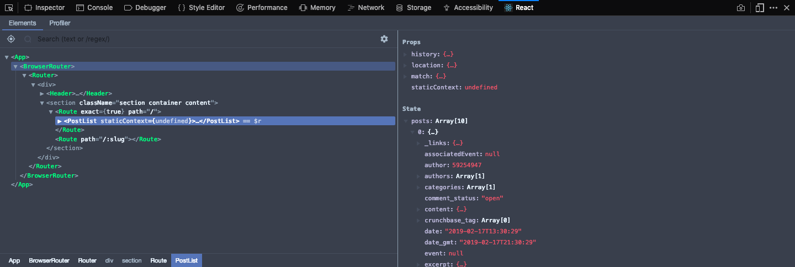

In this article, we will cover how to use WordPress as a headless CMS by leveraging the WordPress API and React js when building a project.

If you've ever wondered whether or not you can use React with Wordpress, the answer is yes. If you've built wordpress sites before then the solution may not be as obvious as one might expect.

## What is a Headless CMS

Before we get into the code, it may be useful to explain how we will handle this. You may have heard the buzz word _"headless cms"_ tossed around if you've searched for an easy way to manage content for your react js project. Because this term is becoming more popular, it may be beneficial to define that sooner rather than later.

> A headless CMS is a back-end content management system that doesn't provide a front-end solution.

By default, Wordpress uses themes and templates to provide a front-end for our Wordpress sites. Building a site like this uses to interact with the database and create structure our users can view. Using this method to build a front-end can have a couple of downsides.

First, it can create sites that aren't particularly performant. While PHP is a versatile language, there are better solutions for building out UIs for our users. Second, Wordpress powers something like one-third of the internet. Because of this, hackers like to try to get into Wordpress sites to access sensitive data. Having a separate front-end prevents users or hackers from knowing it is a Wordpress site at all.

<video src="https://media.giphy.com/media/DBfYJqH5AokgM/giphy.mp4" playsinline autoplay loop muted></video>

### Okay, so how do I use a React js to do this?

Wordpress exposes a REST api that allows access to the data created by the site. We can leverage this technology with a library like Axios to consume the data from our Wordpress site and pull it in to our React.js project. This means that we can have the best of both words: the ease of using Wordpress to manage content and the joy of building with React js.

## Using Wordpress as Our Back-end

Lets take a look at a Wordpress site so you can see exactly what I'm talking about. You can use any Wordpress site for this, even a site being hosted at a subdomain. For this article I will be looking at the [TechCrunch](https://techcrunch.com/) website.

By simply adding `/wp-json/wp/v2/posts` to the end of the url, we will see a JSON output of all of the most recent posts. By simply changing `posts` to `pages`, [we can see the data for the pages in the TechCrunch site](https://techcrunch.com/wp-json/wp/v2/pages).


We can [try out different options](https://developer.wordpress.org/rest-api/reference/) like `posts`, `pages`, `users`, and more. Go ahead and play around to see what data you can find. This will allow us to decide what we want to use and what we don't.

<video src="https://media.giphy.com/media/3diE2vbIarCXWXaN15/giphy.mp4" playsinline autoplay loop muted></video>

## Our React js Starter App

I have created a react [starter you can download from here](https://github.com/iamtimsmith/using-react-with-wordpress-demo.git). The solution is also in there on another branch. You can download the files, run `yarn` or `npm install` (whichever you prefer) and then `yarn start` or `npm run start`. You will see our simple page, but will notice that there isn't any content. Lets get started and add some content.

### Install Necessary Packages

If we open up the `package.json` file, we can see that I have already included `react`, `react-dom`, and `bulma` to build our front-end. Before we can go further with our react js app, we need to add a few more packages.

We can add [Axios](https://github.com/axios/axios) which is a package that allows us to make http requests from our application without any hassle. [React-router](https://github.com/ReactTraining/react-router) can be used to create routes which means that we can switch pages or components without a browser refresh. To install these two packages, we can use the following code in our terminal:

```bash:title=terminal:title=terminal
npm install axios react-router
```

### Add React Router to App.js file

Now that we have our new packages installed, we need to set up `react-router` in our app.js file to tell our browser what should be displayed when different paths are entered into the address bar. To start, we need to import the pieces we need from `react-router` at the top of the file. At the bottom of the imports, add the following code:

```jsx:title=app.js
import { BrowserRouter as Router, Route, Link } from 'react-router-dom';
```

Now that we have imported `react-router`, we can use those components to set up routes. Our current app.js file looks something like this:
```jsx:title=app.js
import React from "react";
import ReactDOM from "react-dom";
import Header from "./components/header";

const App = () => (
  <div>
    <Header />
    <section className="section container content">
      <h1>Hello World</h1>
    </section>
  </div>
);

ReactDOM.render(<App />, document.getElementById("app"));
```

To add a router to our `app.js` component, we need to wrap the outermost `<div>` in a `<Router>` component so we can set up our application's routes. Then we can replace our `<h1>` tag with these two routes:

```jsx:title=app.js
<Route exact path="/" component={PostList} />
<Route path="/:slug" component={PostView} />
```

Let's break this down:

Our first route tells reactjs to show a component called `PostList` when a user visits the home route ([http://localhost:1234](http://localhost:1234)). The `exact` attribute means that it needs to match this route **exactly**, which means that if we have anything after that it will not go to this route.

The second route will show a component called `PostView` when a user visits a wildcard route. The `:slug` denotes that any string after the slash will be a different route in our application. In our case, this string or `slug` (since that's what we named it) will be the slug for the TechCrunch blog post. Our `app.js` file should now look like this:

```jsx:title=app.js
import React from "react";
import ReactDOM from "react-dom";
import { BrowserRouter as Router, Route, Link } from "react-router-dom";
import Header from "./components/header";
import PostList from "./components/postList";
import PostView from "./components/postView";

const App = () => (
  <Router>
    <div>
      <Header />
      <section className="section container content">
        <Route exact path="/" component={PostList} />
        <Route path="/:slug" component={PostView} />
      </section>
    </div>
  </Router>
);

ReactDOM.render(<App />, document.getElementById("app"));
```

Next we need to create the `PostList` and `PostView` components and import them into the `app.js` component.

## Creating our PostList Component

Before starting to create our `PostList` component, we should spend a little time thinking about [what kind of component we should use](https://www.iamtimsmith.com/blog/class-components-vs-stateless-functional-components/). We will be making an http request with axios using the `componentDidMount` lifecycle method and then [we can store it in state](https://www.iamtimsmith.com/blog/this-state-how-to-use-state-in-react/). We can use both state and lifecycle methods in a class component. Now that we have an idea of how this component will be built, we can get started. First we should create the file for the component:

```bash:title=terminal:title=terminal
touch components/postList.js && open $_
```

Next we should import the stuff we will need to build this component. Add these import statements to the top of the `PostList.js` file:

```jsx:title=components/postList.js
import React, { Component } from "react";
import axios from "axios";
import { Link } from "react-router-dom";
```

After that, we can create a class component called `PostList` and set up the constructor and state for the index page of our blog. Our state should hold a list of the posts we will be displaying. Any custom functions we write in this component will be bound to the `this` keyword in this constructor.

```jsx:title=components/postList.js
import React, { Component } from "react";
import axios from "axios";
import { Link } from "react-router-dom";

class PostList extends Component {
  constructor(props) {
    super(props);
    this.state = {
      posts: []
    };
  }
}

export default PostList;
```

Now that we have a place to put the data for our posts, we should create a lifecycle method to pull in that data and assign it to our state. We can do this pretty easily by adding the following code after our constructor:

```jsx:title=components/postList.js
componentDidMount() {
  axios.get("https://techcrunch.com/wp-json/wp/v2/posts").then(posts => {
    this.setState({
      posts: posts.data
    });
  });
}
```

If you're developing React applications often, I would recommend installing the [React DevTools](https://github.com/facebook/react-devtools) in your browser of choice. This makes development with react js very simple and keeping track of data being passed through state and props.

We can now check our state to make sure that it is being populated correctly from our `componentDidMount` lifecycle method. To do this, open developer tools in your browser and go to the react tab. Then we can drill down in the structure until we find our `PostList` component and the pane on the right shows our state and props.



Since we have all of the posts in our state, we can create a render method with structure for our page. To do this in a simple way, we can use a `map()` function which will iterate over each item in an array. Our render method can go after our `componentDidMount` method with the following code.

```jsx:title=components/postList.js
import React, { Component } from "react";
import axios from "axios";
import { Link } from "react-router-dom";

class PostList extends Component {
  constructor(props) {
    super(props);
    this.state = {
      posts: []
    };
  }

  render() {
    return (
      <div>
        {this.state.posts.map(post => (
          <Link to={`/${post.slug}`} key={post.id}>
            <div className="card" key={post.id}>
              <div className="card-content">
                <h3>{post.title.rendered}</h3>
                { post.excerpt.rendered }
              </div>
            </div>
          </Link>
        ))}
      </div>
    );
  }
}

export default PostList;
```

If we run our site with `npm run start` or `yarn start`, we can see that our blog posts are being displayed correctly but we can see the HTML tags being rendered. That's not cool. To render this correctly, we should create a function to use with the `dangerouslySetInnerHTML` attribute.

Lets add a function to do this after our `componentDidMount` but before the `render` method. We also need to bind the `this` keyword inside our constructor. We can then use the `dangerouslySetInnerHtml` attribute to render the post excerpt in a `<div>`. Our completed `PostList` component should look like this:

```jsx:title=components/postList.js
import React, { Component } from "react";
import axios from "axios";
import { Link } from "react-router-dom";

class PostList extends Component {
  constructor(props) {
    super(props);
    this.state = {
      posts: []
    };
    this.createMarkup = this.createMarkup.bind();
  }

  componentDidMount() {
    axios.get("https://techcrunch.com/wp-json/wp/v2/posts").then(posts => {
      this.setState({
        posts: posts.data
      });
    });
  }

  createMarkup(html) {
    return { __html: html };
  }

  render() {
    return (
      <div>
        {this.state.posts.map(post => (
          <Link to={`/${post.slug}`} key={post.id}>
            <div className="card" key={post.id}>
              <div className="card-content">
                <h3>{post.title.rendered}</h3>
                <div
                  dangerouslySetInnerHTML={this.createMarkup(
                    post.excerpt.rendered
                  )}
                />
              </div>
            </div>
          </Link>
        ))}
      </div>
    );
  }
}

export default PostList;
```

## Creating a PostView Component

If we look back at our `app.js` file, we can see that the blog post will be rendered with a `PostView` component, so let's go ahead and create it!

```bash:title=terminal:title=terminal
touch components/postView.js && open $_
```

The code above will create a file to house our `PostView` component and open it in your default code editor. To make things simple, we can just copy the formula for our `PostList` component. We can copy and paste the code from our `PostList` component and make a few small modifications.

First, we need to make sure and change the name of the component from `PostList` to `PostView`. Next we need to modify the `componentDidMount` method a bit. We can add a line of code which will get the `:slug` from the url in the address bar and use that to filter the posts being returned by the Wordpress API down to a single post. Finally, we need to alter the `render` method to display a full post if one exists or not show an error if it doesn't.

The code below will be used for our completed `PostView` component. Take a look at it and see if you can spot the differences and figure out why we handled them this way.

```jsx:title=components/postView.js
import React, { Component } from "react";
import axios from "axios";

class PostView extends Component {
  constructor(props) {
    super(props);
    this.state = {
      post: {}
    };
    this.createMarkup = this.createMarkup.bind();
  }

  componentDidMount() {
    const slug = this.props.match.params.slug;
    axios
      .get(`https://techcrunch.com/wp-json/wp/v2/posts?slug=${slug}`)
      .then(post => {
        this.setState({
          post: post.data[0]
        });
      });
  }

  createMarkup(html) {
    return { __html: html };
  }

  render() {
    let build;
    if (this.state.post.title) {
      build = (
        <div>
          <h1>{this.state.post.title.rendered}</h1>
          <div
            dangerouslySetInnerHTML={this.createMarkup(
              this.state.post.content.rendered
            )}
          />
        </div>
      );
    } else {
      build = <div />;
    }
    return build;
  }
}

export default PostView;
```

## Last Steps for Our ReactJS Blog

We are pretty much set now with our blog. There are just a few more small things we need to do to get our application working how we want. First, it's expected that a logo or site title links back to the homepage. Since we're using `react-router` in our project, we can even do this without a page refresh. To do this, we can open the `components/header.js` file and modify it to look like this:

```jsx:title=components/header.js
import React from "react";
import { Link } from "react-router-dom";

const Header = () => (
  <nav className="navbar is-primary">
    <div className="container has-text-centered">
      <div className="navbar-brand">
        <p className="is-size-3">
          <Link to="/" className="has-text-white">
            Wordpress + React
          </Link>
        </p>
      </div>
    </div>
  </nav>
);

export default Header;
```

The last step for our Wordpress and React js blog is to add import statements to the `app.js` file for our two components, `PostList` and `PostView` so react knows where to get them from. Once you have done this, you should be able to run the application and see the most recent blog posts from TechCrunch.

## Performance Issues with React js

You may notice some issues with load speed or a _glitchy_ sort of feeling where the screen is blank for a second before showing the content. This is because the content is being rendered after the component is mounted so there is a small delay. In addition, search engine crawlers have a hard time reading the content on sites like this because it is loaded via javascript after the page is rendered. There are a few popular ways to handle these issues:

<video src="https://media.giphy.com/media/g9582DNuQppxC/giphy.mp4" playsinline autoplay loop muted></video>

### Gatsby.js, a Static Site Generator

[Gatsby js is one of my favorite tools](/blog/how-to-build-a-blog-with-wordpress-and-gatsby-part-1) to build with in the react js ecosystem. It allows us to build a site or app using React, React-router, and Graphql right out of the box! Then, when we actually build the application, Gatsby js creates static files which make our applications stupid fast.

Because the files for our application are being served statically, they can be very fast as the content is all created beforehand rather than as the page is rendering. This can be a bit tricky since we have to figure out a way to trigger a build when we update the content. [Netlify](https://www.netlify.com/) is my go-to service for this as it's very easy to use and when you push to a certain git branch it will rebuild the Gatsby js project.

<video src="https://media.giphy.com/media/1gUWdf8Z8HCxpM8cUR/giphy.mp4" playsinline autoplay loop muted></video>

### Next.js, Server-Side Rendered React js

Another popular solution to handle these issues is called [Next js](https://nextjs.org/), which provides server-side rendering for react js applications. Rather than using `componentDidMount` to fetch our data after our component has mounted, Next js exposes a new method called `getIntialProps` which allows us to fetch data before the component is rendered.

The fact that Next js offers server-side rendering also fixes the issue with the crawlers having trouble reading content. In addition, the tutorials available on their site are pretty awesome. This would be a great solution if you're building an app [using the MERN stack](https://www.iamtimsmith.com/blog/what-is-the-mern-stack-and-how-does-it-work/) because it can handle frequently changing data.

## Wrapping up our Wordpress and React js project

As you can see, it's really pretty easy to leverage the awesome UI provided by Wordpress while getting to enjoy React js for the front-end. You can take advantage of these tools in your personal projects, enterprise solutions, or freelance work. This is one of those rare occasions where you do get the best of both worlds!
