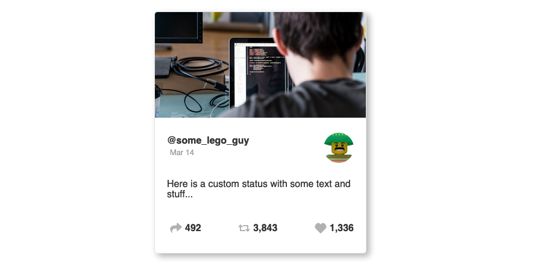
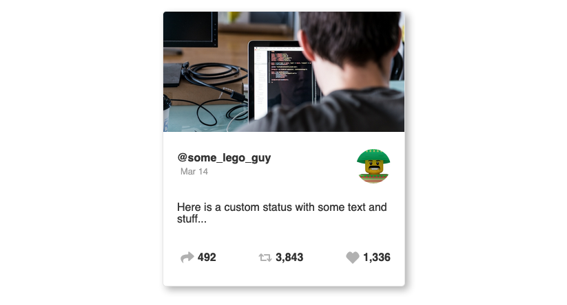

Today we will be covering a few popular methods to style our React JS applications such as Styled Components and Sass to explain the benefits of both.

There is a battle raging in the online development community about whether or not people should be using CSS-in-JS, or CSS-in-Javascript. This post is not to agree or disagree with any of those viewpoints, but rather to give an introduction so you can decide for yourself.

The two tools we'll be covering today are Styled Components, which is a CSS-in-JS library that makes it easy to implement in a React js project. The other tool is called Sass, which has been a popular tool for the past few years in the javascript world.

For each example, we'll be creating a social card component with an image, username, timestamp, user photo, and status. It should also be noted that these aren't React specific. You could use these in Vuejs, Angular, or anything else you're building in javascript.

## Why Do People Argue Over CSS-in-JS?

The primary reason for the debate has to do with separation of concerns. Is it better to write our styles right inside our component? Should we keep our styles separate from our javascript?

I don't know that there is necessarily a "correct" answer. I'm sure there are use cases where each is more appropriate, although I find myself reaching for Sass more often. Let's get into each a bit more so you can decide which you prefer!

## CSS-in-JS

The concept of CSS-in-JS started making waves when it was discussed in 2014. Since then, many different libraries have been created to try and make this concept a reality. A few of these libraries are: [Styled Components](https://www.styled-components.com/), [Radium](https://formidable.com/open-source/radium/), [Aphrodite](https://github.com/Khan/aphrodite), or [Emotion](https://emotion.sh/docs/introduction).

I will be using Styled Components in this post, although I'd suggest checking out each of these since each has it's own syntax and works a bit differently. The documentation for each of these is pretty good to learn the basics and see which feels most comfortable.

### Installing Styled Components

Assuming we already have a React js project set up, we can add Styled Components to the project by running `npm install styled-components` or `yarn add styled-components` in the terminal. This will add the dependencies to the project and get us ready to style our application.

### Creating a Card with Styled Components

The next step will be to [create a component](/blog/how-to-create-a-component/) to show our card. We can use the code below to do this:

```jsx:title=app.js
import React from "react";
import ReactDOM from "react-dom";
import styled, { ThemeProvider } from "styled-components";
import Image from "./images/300.jpg";

const Card = styled.div`
  max-width: 350px;
  border: 1px solid rgba(0, 0, 0, 0.1);
  border-radius: 5px;
  overflow: hidden;
  box-shadow: 5px 5px 10px rgba(0, 0, 0, 0.3);
  margin: 30px auto;
`;

const SocialCard = () => (
  <Card>
    {/* Image goes here */}
    {/* Content goes here */}
  </Card>
);

const App = () => (
  <div>
    <SocialCard />
  </div>
);

ReactDOM.render(<App />, document.getElementById("app"));
```

Let's talk about the code above. You'll probably see some stuff that looks familiar if you're comfortable with CSS and you'll see some stuff that looks a bit weird. Styled Components lets us write styles just like we would in a CSS file, although some other CSS-in-JS libraries would require us to use Camel Casing because it's actually just creating a javascript object.

What the code above is doing is creating a `const` variable called Card which says that `styled` should create a div with the following properties. This can be done for any DOM element, so if you wanted to style an h1 tag you would use `styled.h1`.

### Adding Media Queries and Nesting

Inside of the Card variable, we can also drop in media queries to make things a bit more responsive. If we add a media query like the code below, you can see that when we reach a max-width of 1000px the card background turns red. This isn't a style we actually want to add, it's just for demonstration purposes.

```jsx:title=app.js
import React from "react";
import ReactDOM from "react-dom";
import styled, { ThemeProvider } from "styled-components";
import Image from "./images/300.jpg";

const Card = styled.div`
  max-width: 350px;
  border: 1px solid rgba(0, 0, 0, 0.1);
  border-radius: 5px;
  overflow: hidden;
  box-shadow: 5px 5px 10px rgba(0, 0, 0, 0.3);
  margin: 30px auto;
  @media (max-width: 1000px) {
    background-color: red;
  }
`;

const SocialCard = () => (
  <Card>
    {/* Image goes here */}
    {/* Content goes here */}
  </Card>
);

const App = () => (
  <div>
    <SocialCard />
  </div>
);

ReactDOM.render(<App />, document.getElementById("app"));
```

We can also nest our styles inside of the styled component, which simplifies the code we're writing. If you have used sass or less, you are already familiar with this concept. The example below shows how we can do this to handle styles for the image in our card component:

```jsx:title=app.js
import React from "react";
import ReactDOM from "react-dom";
import styled, { ThemeProvider } from "styled-components";
import Image from "./images/300.jpg";

const Card = styled.div`
  max-width: 350px;
  border: 1px solid rgba(0, 0, 0, 0.1);
  border-radius: 5px;
  overflow: hidden;
  box-shadow: 5px 5px 10px rgba(0, 0, 0, 0.3);
  margin: 30px auto;
  img {
    max-width: 100%;
  }
`;

const SocialCard = () => (
  <Card>
    
    {/* Content goes here */}
  </Card>
);

const App = () => (
  <div>
    <SocialCard />
  </div>
);

ReactDOM.render(<App />, document.getElementById("app"));
```

### Using Javascript in Styles

Another benefit of using CSS-in-JS is that we can mix javascript with styles. I realize this sounds kind of obvious from the concept name, but what I mean is that we can use logic to display things and we can pass variables into our styles. This can become a very powerful tool with a library like React js. We won't keep this style since it's a bit obnoxious, but for the purposes of illustration we can do this with string literals like so:

```jsx:title=app.js
import React from "react";
import ReactDOM from "react-dom";
import styled, { ThemeProvider } from "styled-components";
import Image from "./images/300.jpg";

const border = '5px solid red';

const Card = styled.div`
  max-width: 350px;
  border: ${border};
  border-radius: 5px;
  overflow: hidden;
  box-shadow: 5px 5px 10px rgba(0, 0, 0, 0.3);
  margin: 30px auto;
  img {
    max-width: 100%;
  }
`;

const SocialCard = () => (
  <Card>
    
    {/* Content goes here */}
  </Card>
);

const App = () => (
  <div>
    <SocialCard />
  </div>
);

ReactDOM.render(<App />, document.getElementById("app"));
```

Using CSS-in-JS allows us to keep styles local instead of everything being global or having to add a ton of classes to everything to make it work. This means things can be more concise and we don't have to worry about one style overriding another. In addition, it means we always know where to look if we need to change the style. We don't have to go rooting around in a bunch of CSS files looking for a class.

To do this, we should import the ThemeProvider component from styled-components and provide a theme variable. The theme variable will contain any global variables we wish to use with our styles. For instance, if you have a primary color you are using for the navbar, buttons, and links, it doesn't make sense to hardcode that in every time you want to use it.

### Using a Global Theme

What if you have to update it someday? That sounds like a lot of search and replace waiting to happen. Instead we can declare the global theme variable and access it from any of our styled components. Doing so is pretty simple and is illustrated below.

```jsx:title=app.js
import React from "react";
import ReactDOM from "react-dom";
import styled, { ThemeProvider } from "styled-components";
import Image from "./images/300.jpg";

const theme = {
  primary: 'red'
};

const Card = styled.div`
  max-width: 350px;
  /* border: 1px solid rgba(0, 0, 0, 0.1); */
  border: 1px solid ${props => props.theme.primary};
  border-radius: 5px;
  overflow: hidden;
  box-shadow: 5px 5px 10px rgba(0, 0, 0, 0.3);
  margin: 30px auto;
  img {
    max-width: 100%;
  }
`;

const SocialCard = () => (
  <Card>
    
    {/* Content goes here */}
  </Card>
);

const App = () => (
  <ThemeProvider theme={theme}>
    <SocialCard />
  </ThemeProvider>
);

ReactDOM.render(<App />, document.getElementById("app"));
```

These theme variables can be used in any of our components since the ThemeProvider is wrapped around our entire application. We can then add a styled component to wrap our site in which will take care of all of the global styles such as typography, input styles, and other things that should be standard across all pages.

To demonstrate this, let's add some global styles and some content for our social card. The code below adds the necessary content to the social card and also adds a few global styles to be applied to text.

```jsx:title=app.js
import React from "react";
import ReactDOM from "react-dom";
import styled, { ThemeProvider } from "styled-components";
import Image from "./images/300.jpg";
import User from "./images/user.jpg";
import Heart from "./images/heart-solid.svg";
import Share from "./images/share-solid.svg";
import Retweet from "./images/retweet-solid.svg";

const theme = {
  font: "sans-serif",
  primary: "#333",
  secondary: "#999"
};

const Card = styled.div`
  max-width: 350px;
  border: 1px solid rgba(0, 0, 0, 0.1);
  border-radius: 5px;
  overflow: hidden;
  box-shadow: 5px 5px 10px rgba(0, 0, 0, 0.3);
  margin: 30px auto;
  img {
    max-width: 100%;
  }
  > div {
    padding: 10px 20px;
    > div {
      display: flex;
      justify-content: space-between;
      align-items: center;
      p {
        font-weight: bold;
        span {
          display: block;
          padding: 5px;
          font-weight: 300;
          font-size: 0.8rem;
          color: ${props => props.theme.secondary};
        }
      }
      img {
        max-width: 50px;
        border-radius: 100%;
      }
    }
  }
`;

const SocialSharing = styled.div`
  display: flex;
  justify-content: space-between;
  align-items: center;
  p {
    display: flex;
    align-items: center;
    cursor: pointer;
    img {
      width: 20px;
      padding: 5px;
      opacity: 0.3;
    }
  }
`;

const SocialCard = () => (
  <Card>
    
    <div>
      <div>
        <p>
          @some_lego_guy
          <br />
          <span>Mar 14</span>
        </p>
        
      </div>
      <p>Here is a custom status with some text and stuff...</p>
      <SocialSharing>
        <p>
           492
        </p>
        <p>
           3,843
        </p>
        <p>
           1,336
        </p>
      </SocialSharing>
    </div>
  </Card>
);

const GlobalStyles = styled.div`
  font-family: ${props => props.theme.font};
  color: ${props => props.theme.primary};
`;

const App = () => (
  <ThemeProvider theme={theme}>
    <GlobalStyles>
      <SocialCard />
    </GlobalStyles>
  </ThemeProvider>
);

ReactDOM.render(<App />, document.getElementById("app"));
```

This is obviously a pretty basic example but it's a simple way to get our feet wet with Styled Components. There are also some more in-depth things we can do with it, which we can learn about in the documentation.

Styled Components are very nice because it allows us to throw our styles in the same file as our component rather than opening several different files to find the correct styles. Here is what our finished social card with Styled Components looks like:



## Using Sass in a React Application

Sass was created several years ago and was originally implemented in applications built using Ruby. In recent years, it has been adapted to work with Node.js which is how we will be using it today. You may notice that we are creating "scss" files but calling it _sass_. This is because Sass was originally created with a certain syntax which is actually known as "Sass". Later an alternative syntax was created to closer resemble CSS, and this is called "Scss". Because Scss has the same functionality of Sass, it still falls into the category of Sass.

It is generally pretty simple to get up and running with Sass in a React js application, although it does make a difference how you go about bundling or compiling your application. In the code for this tutorial, I will be [using Parcel js which is pretty easy to get up and running](https://www.iamtimsmith.com/blog/parcel-js-who-says-bundling-needs-to-be-difficult/) and handles the Sass for us. There are other libraries which are sometimes necessary such as [node-sass](https://github.com/sass/node-sass), [gatsby-plugin-sass](https://www.gatsbyjs.org/packages/gatsby-plugin-sass/), or [next-sass](https://github.com/zeit/next-plugins/tree/master/packages/next-sass).

### Setting Up Our Sass Files

There are a few different ways to use Sass within a React js application. The first would be to create a component in a folder and include the styles for the component as a `.scss` file within that folder and import them directly into the component. I have done it this way and have found it to be easy but I didn't care for the organization so much.

An alternative is to create a Sass folder within our project and this is where our styles will live. This is the organizational method we will be using today. That being said, we will create a folder in the project called "Sass" and add a file called "app.scss". While we could put all of our styles into this app.scss file, that would get messy and wouldn't provide much benefit over normal CSS.

Instead, we will create separate files and just import them into the app.scss file. We can then import the app.scss file into our app.js file and Parcel will do the rest.

### Structure of Sass Folder

There are lots of different opinions on how to organize the folder with our styles. We could spend a TON of time going down a rabbit hole of organizational techniques, but I find that the way I like to do it is to organize my Sass folder the same as my project. Typically this would translate out to having the following layout:

- /Sass
  - /Components - A directory which has a .scss file for each React component
  - /Pages - A directory which has a .scss file for each page that requires custom styles
  - /Templates (optional) - A directory for templates if using them (for tools such as gatsby)
  - /`_elements.scss` - Any generic styles for the site. Shouldn't have any classes or ids for selectors.
  - /`_keyframes.scss` (optional) - Any keyframes or animations I will be using for the site.
  - /`_mixins.scss` - Any mixins (style snippets) that will be used over and over
  - /`_variables.scss` - Any variables that will be used throughout styles
  - /`app.scss` - The file that imports all other scss files

The first thing you may notice about the file names is that several of them start with an underscore. This is because outside of node, Sass is actually compiled to a CSS file. Any SCSS file without an underscore at the beginning is compiled as a different stylesheet. Since we are pulling all of our stylesheets into the app.scss file rather than separating them out, they should all start with an underscore.

Since our application is only one social media card, we won't need all of these. For the sake of simplicity while explaining this, we will be using the app.scss, the \_variables.scss, and the \_elements.scss files as well as the components directory.

That being said, let's get started!

### Setting up variables in Sass

Since we have some variables in our Styled Components styles, we can go ahead and set them up here too. To do this, create a file called `_variables.scss` in the Sass file for our styles. Inside of the `_variables.scss` file, add the following code.

```scss:title=sass/_variables.scss
$font: sans-serif;
$primary: #333;
$secondary: #999;
```

Once we have some variables added, we should import this into the `app.scss` file. Since we want to use these variables anywhere in our styles, this import should be toward the top of the import list. The following line of code will add the variables to our styles. We can also see that we don't have to include the underscore or file extension in the import statement because Sass is smart enough to know that's what we mean.

```scss:title=sass/app.scss
@import "./variables";
```

### Creating global styles for elements

We created some global styles for our styled components application which set our font to a sans-serif font and set the color of our text to `#333`. Let's go ahead and create those styles in Sass too. To start, we will create a `_elements.scss` file in our Sass folder. Below are the styles I'm using for this file and you will notice that I'm using the variables that we created just like we did with the styled components.

```scss:title=sass/_elements.scss
html {
  body {
    font-family: $font;
    color: $primary;
  }
}
```

Now we can import the `_elements.scss` file into our app.scss file. See if you can do it without looking. Our app.scss file should now look like this:

```scss:title=sass/app.scss
@import "./variables";
@import "./elements";
```

### Adding Classes to Elements in Component

So we can target the elements in our React js component, we should add some classes and/or ids. CSS frameworks like Boostrap and Foundation require a lot of classes which can get pretty messy. My favorite code is the code that doesn't have 30+ classes on an element for styles, so with that in mind let's go ahead and add some classes to our component with the code below:

```jsx:title=app.js
import React from "react";
import ReactDOM from "react-dom";
import Image from "./images/300.jpg";
import User from "./images/user.jpg";
import Heart from "./images/heart-solid.svg";
import Share from "./images/share-solid.svg";
import Retweet from "./images/retweet-solid.svg";
import "./sass/app.scss";

const SocialCard = () => (
  <div className="social_card">
    
    <div className="social_card_body">
      <div>
        <p>
          @some_lego_guy
          <br />
          <span>Mar 14</span>
        </p>
        
      </div>
      <p>Here is a custom status with some text and stuff...</p>
      <div className="social_interactions">
        <p>
           492
        </p>
        <p>
           3,843
        </p>
        <p>
           1,336
        </p>
      </div>
    </div>
  </div>
);

const App = () => (
  <div>
    <SocialCard />
  </div>
);

ReactDOM.render(<App />, document.getElementById("app"));
```

Awesome! Let's start styling our component! Inside the Sass folder, create a new folder called "components". This folder will hold the styles for all of our React js components. Typically, I would put each component into it's own file, this is a pretty simple application so we will keep it in the app.js file.

We can set up styles the same way as our styled components since Sass can also handle nesting and media queries as well. Since our import statement will occur after the variables import in app.scss, we can use anything that was imported before this file. This is useful with mixins, which are code snippets that you can reuse. You can even create a sort of function where you pass in an argument and use that throughout the mixin code.

The code below will style the social card to look the same as our styled components social card:

```scss:title=sass/components/_socialcard.scss
.social_card {
  max-width: 350px;
  border: 1px solid rgba(0, 0, 0, 0.1);
  border-radius: 5px;
  overflow: hidden;
  box-shadow: 5px 5px 10px rgba(0, 0, 0, 0.3);
  margin: 30px auto;
  img {
    max-width: 100%;
  }
  .social_card_body {
    padding: 10px 20px;
    > div {
      display: flex;
      justify-content: space-between;
      align-items: center;
      p {
        font-weight: bold;
        span {
          display: block;
          padding: 5px;
          font-weight: 300;
          font-size: 0.8rem;
          color: $secondary;
        }
      }
      img {
        max-width: 50px;
        border-radius: 100%;
      }
    }
    .social_interactions {
      display: flex;
      justify-content: space-between;
      align-items: center;
      p {
        display: flex;
        align-items: center;
        cursor: pointer;
        img {
          width: 20px;
          padding: 5px;
          opacity: 0.3;
        }
      }
    }
  }
}
```

Now we can go ahead and write the import statement in the app.scss file so we are pulling in the styles for the card.

```scss:title=sass/app.scss
@import "./variables";
@import "./elements";
@import "./components/socialcard";
```

And just like that, here is the final Social Card component with our sass styles. It looks the same as the component did in Styled Components.



## Final thoughts on Sass vs Styled Components

As you can see, both Sass and Styled Components are valuable ways to supercharge styles in React js applications. Ultimately, I think that you should use the one that you enjoy using the most. I find myself reaching for Sass more often, but I also enjoy using CSS-in-JS in some of my personal projects. If you'd like the code referenced in this post to look at or play around with, [it can be found here](https://github.com/iamtimsmith/styled-components-vs-sass).
