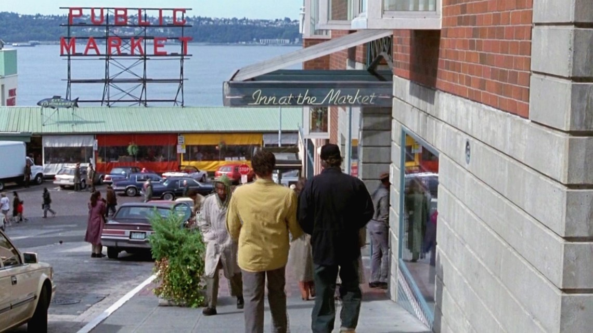
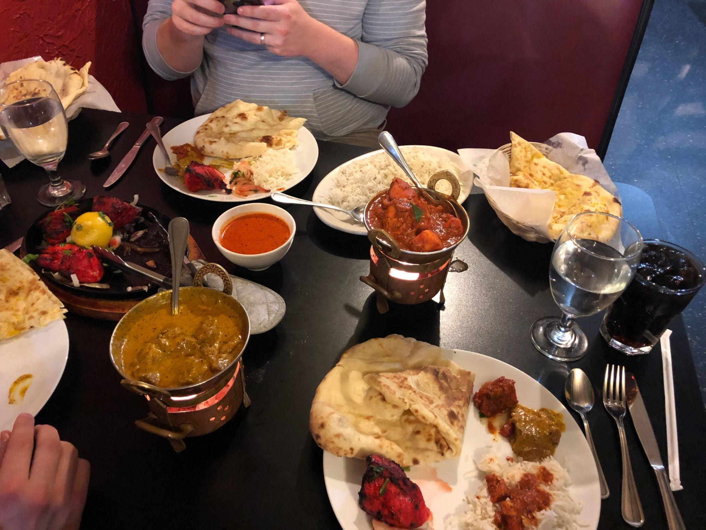
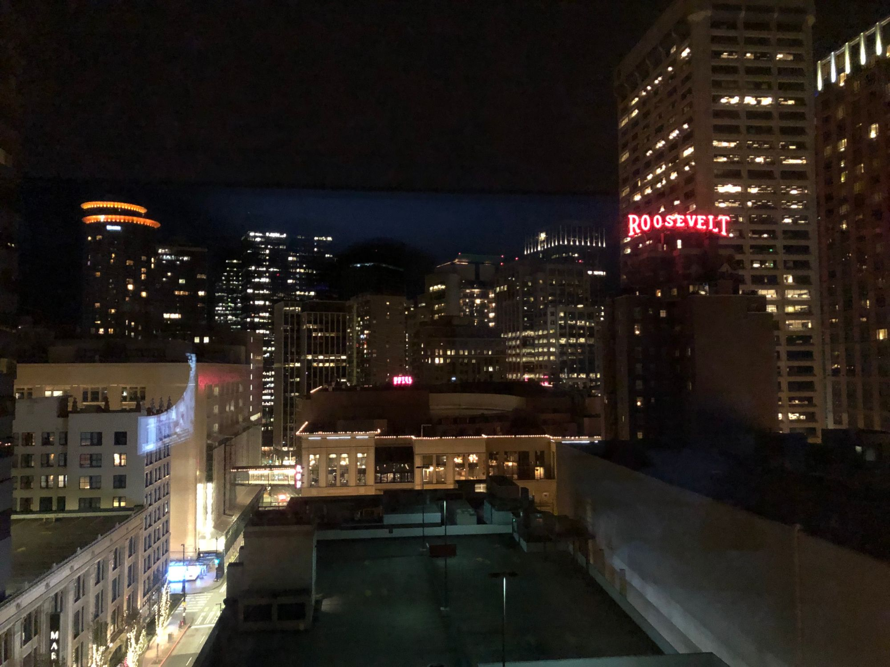
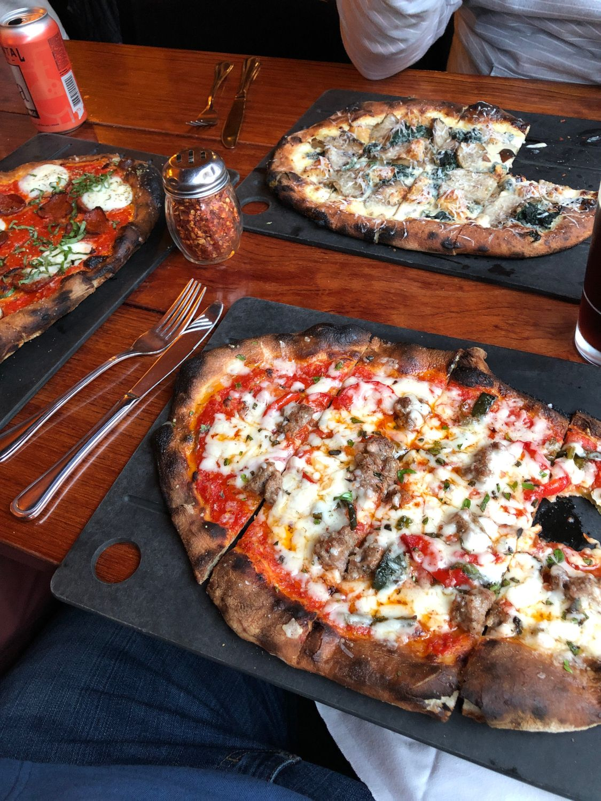
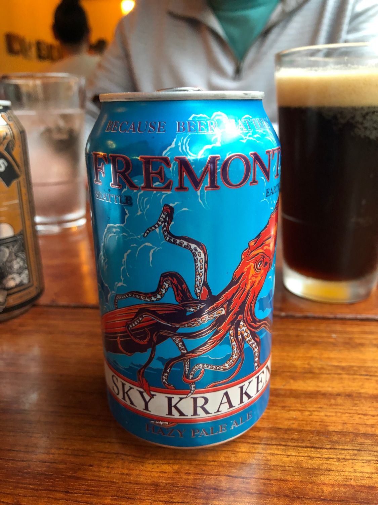
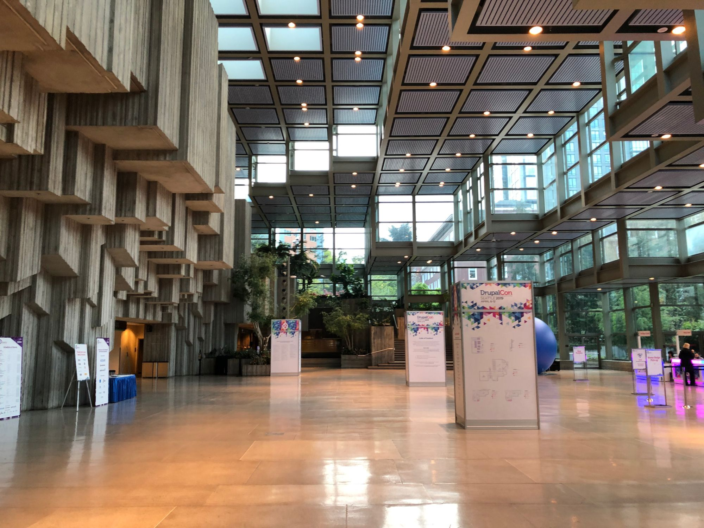
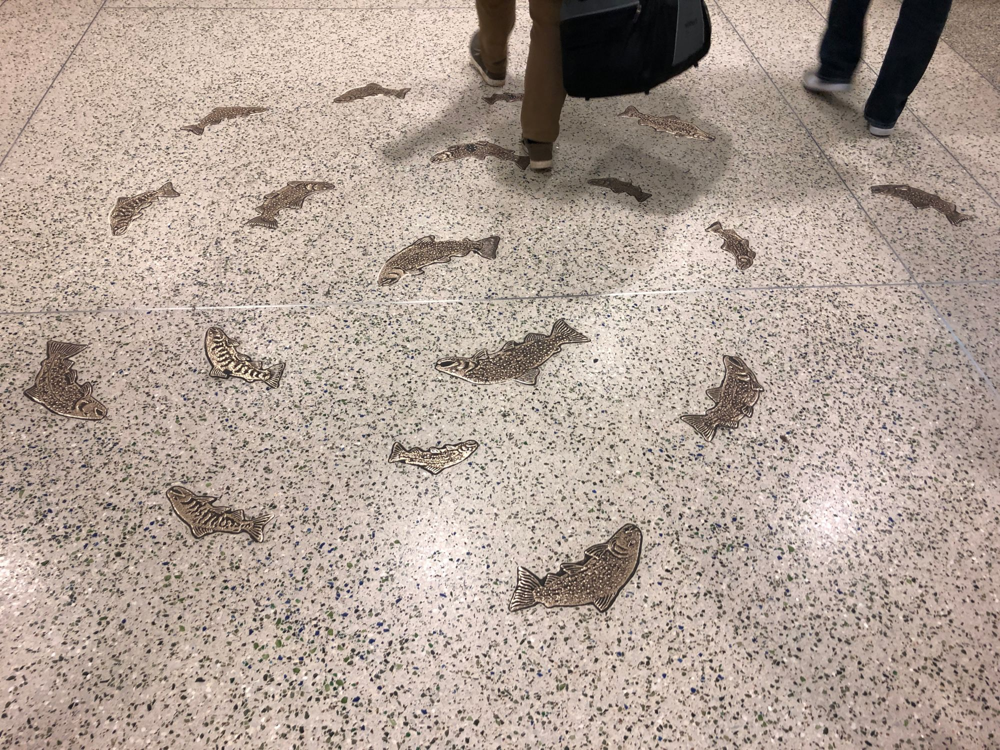

I recently attended my first tech conference. In this article I'll talk about what I learned, what to expect, and how to prepare to have a great time!

If you've ever thought about attending a conference, meetup, or workshop or you're signed up to attend one, this article is for you! I'll talk about experiences I had at my first conference, things I'm glad I did, and things I wish I had done. Hopefully this will help you get the most out of your first (or next) event.

## A Little About Me

I'd like to start by saying that I'm an introvert. When I took the Myers-Briggs test, I learned I'm an INFJ, which in short is a person who can be very social but then needs alone time for a while. I'm the kind of guy who walks around work with headphones on, even if I'm not listening to something just so people don't try to make small talk with me. In a work setting, I have no problem with talking to people and working as part of a team. Socially, meeting new people is uncomfortable at best.

### The Team I Got To Go With

My employer recently sent me to attend DrupalCon in Seattle, WA along with my team (consisting of my boss Andy and another developer named Griffin). I've been in this position for about 6 months, and in that time have gotten to know the two others on my team fairly well in a work context and we've even gone out a few times for drinks and arcade games.

I've never travelled for work or even gone on trips with anyone other than family. I really had no idea what to expect for this 5 day trip with co-workers. Fortunately, the guys I work with are pretty cool and laid-back which made everything much easier than it could have been.

## Day 1: Getting to Seattle

We all met at our local airport around 6:15am to get ready for our flight. We were flying to Minneapolis and then to Seattle. I'd never been to Seattle, but in high school I was really into Nirvana and then later Death Cab for Cutie so I had a little familiarity with the city and their musical history.

As a quick side note, if you're looking for stuff to do on a flight: I highly recommend downloading some podcasts. They're free, you can get hours' worth of material, and there are podcasts about most subjects. A few I recommend are [Syntax.fm](https://syntax.fm/), [Full Stack Radio](http://www.fullstackradio.com/), [Sneak Attack](https://sneakpodcast.com/), or any number of true crime podcasts. I spent a lot my plane ride listening to [Cold](https://thecoldpodcast.com/), which coincidentally happened in Seattle.

We arrived in Seattle around 10:30am and made our way to the hotel. Our hotel was right next to the conference center and within walking distance of a lot of things, so after getting everything dropped off, we decided to go adventuring a bit.

  

    
  

  

    
  

We stretched our legs and started looking for some lunch, when we came across a bar with some seafood and american food. We had lunch and decided to keep exploring the downtown area. We found the Pike Place Market and wanted to see more of that. Immediately I remembered the scene in Sleepless in Seattle with the Pike Place market and had to snap a shot which matched. It was pretty cool how little it had changed.

First we found the infamous gum wall where Griffin had to get some pictures. In case you're unfamiliar with this (I hadn't ever heard of it), it's a little tunnel where people have stuck their used gum for quite some time.

  

    
  

  

    
  

After wandering through this hall, we came across [a brewery](https://www.pikebrewing.com/) and decided to relax for a bit. We talked about everything from Drupal to movies and comic books. We stayed there and talked for a few hours before deciding to seek out some dinner. We'd heard of the Pink Door but found out it was really busy so we wouldn't be able to eat there. While we were making our way to the Pink Door, we found a little indian restaurant and decided to eat there. I hadn't ever had indian food but made it a sort of mantra that I was going to try new things on this trip.

I liked the indian food a lot and we had great conversation. Our previous conversations continued as we talked about travel, various programming languages, and what we wanted to do while we were in Seattle. After dinner, we decided to call it a night since we'd been travelling and exploring all day.

Getting back to my hotel room and seeing Seattle at night was pretty awesome. It certainly left me feeling excited to be there and ready for the next day.

  

    
  

## Day 2: First Training

Monday started early for me since I was still on midwest time. I woke up and started getting ready. Even had time to get my room picked up and watch some tv before heading to my first training.

I've only been working in Drupal for about 6 months at this point and even then, it's in Drupal 7. We're looking to move to Drupal 8 this year, so the class I took on Monday was Module Development with Mike Anello from [DrupalEasy](https://www.drupaleasy.com/). I learned a lot and even made a couple of new friends (one of whom was in the training with me).

  

    
  

  

    
  

After our trainings had wrapped up Andy, Griffin, and I went to go find dinner. After some debate, we ended up going to a sushi restaurant. I've never cared for sushi but decided this trip was about trying new things so I went with it. We got sashimi and a bunch of rolls to share. What do you know? I liked it a lot. I even got it on my birthday after we got back home. Dinner wrapped up and we decided to do a bit of walking around and shopping before going back to the hotel. We found some neat boutiques and eventually found an arcade bar. Griffin was super excited about finding the biggest foosball table he'd ever seen. We played a few games and we were both winded by the end of the first game because so much running was involved to get from one end of the table to the other.

## Day 3: Second Training and Pantheon party

Tuesday started much like Monday had. My training for Tuesday was the Absolute Beginners Guide to Drupal 8. Initially we had thought this would be about some basic theming and coding for Drupal 8, but as it turns out it was more geared toward basic users and a lot of review for me. It was taught by Steve Burge of [OSTraining](https://www.ostraining.com/) who I thought did a great job. A lot of people seemed to learn a lot who were new to Drupal.

Even though I didn't learn a ton of new stuff from this training, that doesn't mean it was worthless. We did get a book which covered each topic from the training in depth. I also got to see how he taught and how the others in my training learned which could not only be valuable when I give talks in the future, but also to help explain these things to potential new team members who may not be familiar with Drupal.

After the training let out, the exhibition hall opened up for people to check out. I made a bee-line for the Gatsby booth and when I got there, I met none other than Kyle Matthews (the creator of Gatsby and one of my heroes). We talked for a bit and as it turns out, we had been discussing some blog posts for the Gatsby site so he was already familiar with me. This was both a moment of shock and excitement and probably one of the geekiest moments on the trip as I was star-struck by the inventor of an opensource project I use all the time.

Once we left the exhibition hall, we heard about a party being put on by Pantheon at the Museum of Pop Culture so we decided to go to that. Before going to the party, we found some food at a small but [delicious pizza restaurant](https://www.seriouspieseattle.com/downtown). We got 3 pizzas with different toppings as well as some local beers. Overall, it was pretty tasty. For desert, we had stout floats with another local brew. If you're in the mood for artisan pizza and some Seattle beers, I recommend Serious Pies.

  

    
  

  

    
  

  

    
  

After having dinner, we had a bit of a walk to the party so we started making the trek there. We talked about work related topics as well as other things we'd been learning or hearing about at Drupalcon. We walked right past the Space Needle on our way there which was cool. Arriving at the party, we were greeted with a nightclubish sort of feeling. 90s and early 00s music played on the stereo and we were given a few free drink tickets.

A few of the friends we'd made in our trainings were waiting for us and we started to explore. First we went downstairs where they had props from lots of movies ranging from Star Wars and Ghostbusters to Alien and Silence of the Lambs. Then we made our way up to the top floor to check out the Pearl Jam display. It had tons of posters, photos, and guitars used by the band over the last 30 years.

Back on the main floor, we saw a Jimi Hendrix display, a Prince display, and a room of guitars owned by famous musicians. Finally we got to the most exciting artist's room for me, Nirvana. I was a huge Nirvana fan in high school, so seeing their instruments, drawings, writings, and clothing was like a dream come true for the 16 year old me.

Also on the main floor was an indie game room to try out games on various consoles developed by indie companies. We spent a decent amount of time in this room since we all enjoy video games. Our last stop in the museum was a room with instruments for people to play around with. They had electric guitars, keyboards, drums, basses, and even some practice rooms where we could all jam together.

We caught Lyft back to the hotel and discussed all of the cool things we'd seen at the party before heading to bed in preparation for the Driesnote first thing in the morning.

  

    
  

  

    
  

## Day 4: The Driesnote, Sessions, and the MediaCurrent Party

Day 4 started bright and early with the Driesnote, the keynote speech by Drupal founder Dries Buytaert. I ended up sitting right behind him and actually got to meet him after the Driesnote had concluded. He was a really cool guy who seemed very interested in the community and actually took the time to learn my name. Certainly not what I expected from someone in his position!

  

    
  

  

    
  

After the Driesnote, sessions began. Sessions are like 30 or 90 minute lectures on a given topic. There are tons of sessions available on a variety of topics and you pick the ones that sound interesting and attend. I decided to attend a session called OOP: The Quest for Pokémon to brush up on my object oriented programming.

Throughout the day I attended more sessions about Gatsby.js, security, and design. When we left the conference center, we went to a barbeque restaurant near Pike Place market for a meeting with some potential business contacts. It took us about ten minutes to find the entrance because it was on the second floor of a building slightly off from where the GPS told us to go.

Following my mantra for the trip, I tried liver. It was surprisingly good considering my only prior experience was liver and onions with my grandma. We also had some whiskey (it was a whiskey bar) which was actually pretty good and discussed the party we'd all heard about at the Science Museum. Once our meeting over dinner had concluded, we all headed to the party put on by MediaCurrent. There was karaoke in a laser dome which was definitely a first for me. Songs ranged from "A Whole New World" from Aladdin to Metallica songs, which was pretty cool.

We roamed around the museum playing with lots of different things. We were all laughing pretty hard when we tried out an aging simulator where you take a picture of yourself and decide whether you want smoking damage, sun damage, or liver damage and then it would age your picture appropriately. Overall, it was a pretty fun evening spent with new and old friends.

## Day 5: More sessions and a Pizza Mart

The first session I went to was called Harry Potter and the Linux Command Line Interface. It compared the command line to using magic in Harry Potter, which I thought was both interesting and effective. The speaker also compared Defense Against the Dark Arts to preventing hackers from accessing your system and how to troubleshoot if they do. Throughout the day I attended sessions about healthy work culture, the new admin UI for Drupal, and test driven development. Once our sessions finished up, we said goodbye to the convention center and started to figure out what was going on that night.

We didn't really have anything planned after the sessions and this was our last night in Seattle, so we decided to wing it. Andy and I were wandering around looking for something to eat and we walked past a bar that smelled like really good pizza. We went in and checked the place out. It just so happens that Thursdays were all-day happy hour so we grabbed a booth. Griffin met us there shortly after we found it and we ordered beers and pizzas, then got out the trusty game we'd been playing all week while we waited for food. It's called "Love Letter", but it was the Batman edition.

  

    
  

  

    
  

We played for a while while _It's Always Sunny in Philadelphia_ played on the TV. After a while, a few of our friends from Drupalcon met us there and we discovered the bar had board games. We all enjoyed a few rounds of Cards Against Humanity while we also told stories and joked around. Eventually, our friends decided to call it a night since their flights left the next morning. Andy, Griffin, and I stuck around and started talking about work. We talked about friendships within the workplace, how we felt about some recent process changes, and how we could improve on-boarding for anyone joining the team. It's easily the closest I've felt to them, which allowed us to have in-depth conversations rather than just banter here and there.

## Day 6: The trip home

We left on day 6 and headed home. None of us are particularly extroverted, so we were all very tired from the week of learning and socializing. Things went according to plan and we made it home in one piece. I relied on my trusty podcasts to keep me entertained on the trip. We even found some time to play the Love Letter game while we waited in the airport for one of our flights. It was a nice quiet end to one of the most fun weeks I've had in a long time.

  

    
  

## Takeaways

That was a lot of reading to get through my experience, sorry if it was a little boring. Here's the stuff you came for though. Throughout the week, I had a lot of new experiences and met a lot of people. It was really fun and I'm excited for my next Drupal event. I'm even thinking about submitting a session at a meetup! Below are the top things I learned and would recommend for your first (or next) tech conference:

### 1. Be open to new experiences, foods, etc.

You never know when you'll find something new that you like, but that can't happen if you aren't willing to try things. Being open to new experiences will not only expand your own horizons, but open the door to friendships you may otherwise never have.

  

    
  

### 2. Bring business cards to give out.

Having business cards to hand out is a handy way of making friends. You will meet a lot of people over the course of the conference and it can be hard to remember names, faces, and contact information. We used business cards to get a hold of each other to hang out in the evenings and make those friendships stronger. Pro tip: When someone gives you a business card, write down where you met them, common interests, etc to make it easier to remember them after the conference.

### 3. Don't be scared to talk to strangers

Generally speaking, I don't care much for socializing. I'm not what you would call a social butterfly, but I decided to get out of my comfort zone for a week. The stakes are pretty low. If you hit it off with someone, you make a new friend and connection. If you try talking to someone and they aren't particularly friendly or you just don't jive, you most likely won't see them again so it's not a big deal!

### 4. Take time for yourself

Being at a conference can be exhausting. There are tons of people everywhere, you're constantly taking in new information, and it's an all day event for several days in a row. It's pretty understandable to need some alone time to unwind. If that's the case, take some. Go back to the hotel room and relax for a bit if needed, go to the exhibition hall alone and just wander around, or even just find a comfy chair and tune out for bit.

### 5. Enjoy yourself

If something sounds interesting, check it out! The opportunity may not present itself again, so seize the moment. The worst thing is wishing you would have done something when you had the chance, but were too nervous or scared.

## Conclusion

Tech conferences, meetups, or camps can seem like a very initimdating thing. There is a lot of knowledge to be gained from attending and a lot of people to meet. I highly encourage anyone interested in trying one out to do so. Not only is it an opportunity to make new friends, learn a ton, and experience new things, but it's a good way to get closer to friends and coworkers attending with you.

Have questions about this post? What are your experiences with tech conferences? @ me [on twitter](https://www.twitter.com/iam_timsmith).
