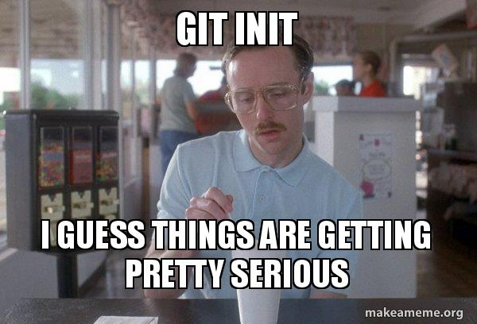

Git is a tool which allows you to take \"snapshots\" of your project. I'm going to show you how to get started with git so you can improve your worklow.

If you're anything like I used to be, a ton of your hard drive is eaten up by several different copies of the same project. Each one represents a different set of changes you've made so you can have different versions without screwing up a different one. While I had the right idea, my execution was very poor.

If you've been around in the development world for a while, you've probably heard of Git. If you're just starting out as a developer, then let me be the first to welcome you and tell you that you've made a good investment by learning Git. I would argue that it is one of the most important things you can learn in terms. It doesn't take long to get the fundamentals down, but will pay dividends in no time at all.



Today we're going to cover those basics so you can start using git in your projects and saving yourself a lot of time, energy, and hard drive space. Let's get started!

## What is git?

Before we start getting into how to use git, we should first talk about what Git is. Git is a system built to help you organize changes, create releases, and collaborate with others on a project. Git projects can be stored locally (only on your machine) or remotely (online somewhere like GitHub, BitBucket, or GitLab) depending on what you want to do with it.

Using version control in a project allows you to make a copy of your project, make and test your changes, then merge it back in with the original copy. The benefit here is that we can see it working before we add it in to the original project so we aren't breaking the stuff that's already working.

## Installing git on your machine

Getting git installed on your machine is generally a pretty simple task. There are some different tools you can use to install git on your computer, so I'll talk about each of those briefly.

### MacOS with Homebrew

I like to use Homebrew on my mac, which allows me to install packages quickly and easily. To install Homebrew, just [go to their site](https://brew.sh/) and copy the line of code where it says "Install Brew". You can then paste it into your terminal, hit enter, and let it do it's thing.

Once you have brew installed, you can run the command below to install git:

```bash:title=terminal
$ brew install git
```

### Windows with installer

Installing git on a Windows machine can be accomplished by visiting [https://gitforwindows.org/](https://gitforwindows.org/). There you can find a download link which guides you through the installation.

### Linux with apt-get

If you're working on a Linux machine with apt-get, you can run the command below in your terminal and get all set up:

```bash:title=terminal
$ sudo apt-get install git
```

### Making sure git is installed

As a final check to make sure it was installed correctly, you can go to your terminal (regardless of operating system) and run the following command:

```bash:title=terminal
$ git --version
```

This will show you the current version of git you have installed. If you get an error, then git wasn't installed correctly. Once you've verified that you have git installed correctly, you can go on to the next section where I'll start getting into some commands.

## Basic commands in git

There are a few basic commands you'll use all the time in a git project. In this section, we'll go over those commands so you can get started in your own projects.

### Create a project

Before you can really start leveraging git in your project, you have to initialize it. Doing so is pretty simple since it only requires a 2-word command:

```bash:title=terminal
$ git init
```

Running this command will create a new directory called `.git` where our commit history will be stored. Now you can start adding commits to your project.

### Stage your changes

Before you can actually commit your changes, you will need to "stage" them. This just means that the changes for a particular file are being added to a holding area before they actually get commited. This is beneficial because it allows you to choose what you want to commit instead of just doing everything. The command below illustrates two ways to do this:

```bash:title=terminal
$ git add example1.js example2.js

$ git add .
```

The syntax for the command above is "git add" followed by the files you want to add to staging (like the first line). In the second line, you can see that I've replaced the file names with a period, which tells git that I want to add all files that have been changed to staging. More often than not, I'm using the period rather than listing the files explicitly.

### Seeing what's staged

To see what files are currently staged and unstaged, you can use the following command:

```bash:title=terminal
$ git status
```

The green text indicates files that are staged to be commited. The red text shows files that aren't currently staged.

### Take a snapshot

Now that you have your changes staged, you are ready to commit them. The commit itself is the snapshot of your code at this point in time. Projects can have many commits over time and a log is kept of each one so previous commits can be revisited if necessary. To add a commit, take a look a the following code:

```bash:title=terminal
$ git commit -m "This is a message"
```

The command above begins with "git commit" followed by a flag, "-m". This flag tells git we're adding a message to our commit which we can use to describe what was done in the commit. This is very helpful down the road when we're trying to find a particular change that was made, so make sure to be descriptive but concise. One to two sentences is typical for a commit message. The text in the quotation marks is the message itself.

### See previous commits

Now that you have a commit made in your project, let's take a look at your commit history. The command to do this is another 2-word phrase:

```bash:title=terminal
$ git log

commit bb50464992dcd7ed2af724c17236c6d5eecc9315
Author: Your Name <yourname@My-MacBook-Pro.local>
Date:   Thu Jun 27 22:05:58 2019 -0500

    This is a message
```

Upon running the command above, you should see some output that looks like the output below. It gives some basic information like a unique ID, the author, the date and time of the commit, and the commit message. As you add more commits, you will see more than just one. To exit the log, just type "q" and it will take you back to the normal editor.

<video src="https://media.giphy.com/media/kRmglZUDvDG/giphy.mp4" playsinline autoplay loop muted></video>

## Creating different versions

### See all of your versions

In git, different versions of the project are called branches. The default branch is called `master` and is typically used as a production branch and generally isn't worked on directly. To get around this, different branches are created, modified, and merged back into master. It is common to have several different branches in a project with different changes being made. To see all of the branches in your project, just run the following command:

```bash:title=terminal
$ git branch
```
Running this command will return a list of branches, in this case only "master" with an asterisk next to it. The asterisk denotes the current branch you are on.

### Change to a different branch

In the event that we aren't on the right branch, we can switch over to it pretty quickly. The command below will switch to a different branch:

```bash:title=terminal
$ git checkout master
```

In the command above, "git checkout" tells git we are switching to a different branch and "master" is where you will tell git which branch you'd like to switch to.

### Create a branch

I mentioned that you should create a new branch to avoid working on master directly, so I'll show you how to do that. The first step is to make sure you're on the branch you want to copy for the branch. Once you're on the correct branch (in our case "master"), use this code:

```bash:title=terminal
$ git checkout -b sample-branch
```

By running the code above, git makes a copy of our current branch (master) and calls the new copy "sample-branch" before switching to it. The -b flag is what tells git this is a new branch. Please note: Branches have to have unique names and this command will not work if a branch with the same name exists in this project.

### Deleting a branch

To delete a branch, you need to switch to a different one first. Then you can run the command below to delete it. Beware: This cannot be undone.

```bash:title=terminal
$ git branch sample-branch -D
```

The command above starts with "git branch" followed by the name of the branch you want to delete. The "-D" flag at the end is that tells git you want to delete the noted branch. Once a branch is deleted, you can reuse the branch name if desired.

<video src="https://media.giphy.com/media/zlLydol7ndM7C/giphy.mp4" playsinline autoplay loop muted></video>

## Working with remote repositories

No, no, no... not that kind of remote. A git project is called a repository (or repo for short) and when it's stored somewhere online it's called a remote repository. There several different services to do this, but the most popular are [Github](https://www.github.com), [Bitbucket](https://www.bitbucket.com), and [Gitlab](https://www.gitlab.com). All of these have free plans to get you going and those do the job for most individuals.

### Adding a remote location

Next, we'll talk about how to add one of these to your project. Before you can send your project to a remote location, a repo needs to exist at that remote location. The services I mentioned make it quick and easy to create an empty repository. Once the repo is created, grab the url for the repo (there's usually a dropdown or other method to get this). Then use the command below to add the remote location:

```bash:title=terminal
$ git remote add origin https://github.com/sampleuser/sample-remote-location.git
```

The first part of this command, "git remote" tells git we're doing something with a remote location. The "add" piece tells git that we're adding a location. Next you will see "origin" which is an alias you want to set for the url (origin is the standard naming convention), followed by the url for that alias.

### Send your repo to the remote location

Once you have your changes committed and you're ready to send them to your remote location, you can use the following command:

```bash:title=terminal
$ git push origin master

$ git push --set-upstream origin new-branch

$ git push origin master -f
```

Above you can see the beginning of the command is "git push" followed by the alias of the remote repo we're pushing it to and the branch we want it to go to. If the branch doesn't already exist at the remote location, you can use the second line of code. Modifying the command in this way tells the remote location that you're providing a new branch so it needs to add that instead of updating an existing one. It should be noted that the branch name you're using in this command needs to match the branch you're currently on.

In some cases, you may get an error when trying to push to a remote repo. This could be if you're working on a branch and had to go back a few commits and make a some changes and now your local version is behind the remote version. In these cases, you can add a "-f" flag to the end (like the third line) which will force it to update with what you're pushing, even if they're different. This is typically not recommended, but is sometimes necessary so I thought I'd include it.

### Getting changes from the remote location

A huge benefit to working with git repos in a remote location is the collaboration opportunity. Many developers can be working in a repo at the same time without stepping on each other's toes. Once a developer finishes their changes, they push them to the remote location where they can get merged into the master branch or whatever they're doing with it. 

_Okay, cool. But how do I get their changes into what I'm working on so I know it doesn't break anything?_ I'm glad you asked. There's another command we can use to pull in any changes that have been made to the remote copy of the branch for this very reason. It's usually a good idea to do this daily or even more frequently if you'd like to make sure you always have an updated version of the project. To get any changes that have been made, you can use the following command:

```bash:title=terminal
$ git pull origin master

$ git pull --rebase origin master
```

This syntax should look pretty familiar by now. It's "git pull" followed by the alias for the remote location and the remote branch from which you'd like to update. If you already have some changes made and want to pull in any new changes and put your additions on top of them, you should use the "--rebase" flag like line 2. This will temporarily remove your changes, pull in the new stuff from the remote location, then add your changes back on top of it.

### Getting a local copy of a repo

If you get a new computer, start working on a new project, or even just find some code you want to run on your machine it may be necessary to download that repo to your machine. You could just download the .zip file, decompress it, and stick it where you want it but wouldn't it be cool if there was a way to do it from the command line?

You're in luck. There is. All you need is the url for the repo, which can be found in Github, Bitbucket, and Gitlab pretty easily. Navigate to the folder where you want the project to live, then run the command on the first line below replacing the URL with your repo's URL and watch it go!

```bash:title=terminal
$ git clone https://github.com/sampleuser/sample-remote-location.git

$ git clone https://github.com/sampleuser/sample-remote-location.git folder-name
```

By default the repo will be put into a folder with the name of the remote repo, in this case "sample-remote-location". If you'd like a different folder name, you can add that after the URL and it will change that for you when downloading.

## Wrapping up

Git is a tool I'd recommend both experienced and new developers to use. It has saved my ass many times and makes the developer experience much more enjoyable. In addition, projects become much more collaborative and even lets people on different contentinents work together! If there's one thing I'd suggest learning early on in your development career, it's git.

If you have any questions or run into problems, feel free to reach out to me on Twitter at [@iam_timsmith](https://www.twitter.com/iam_timsmith).